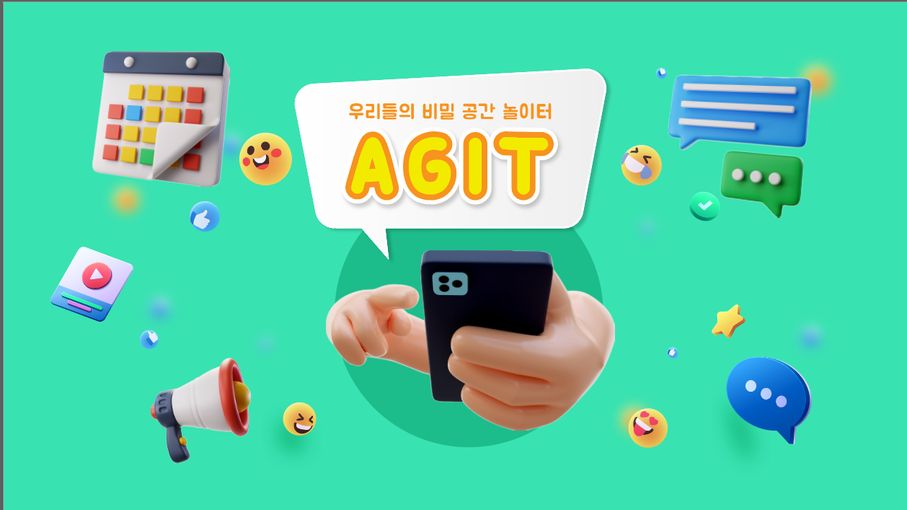
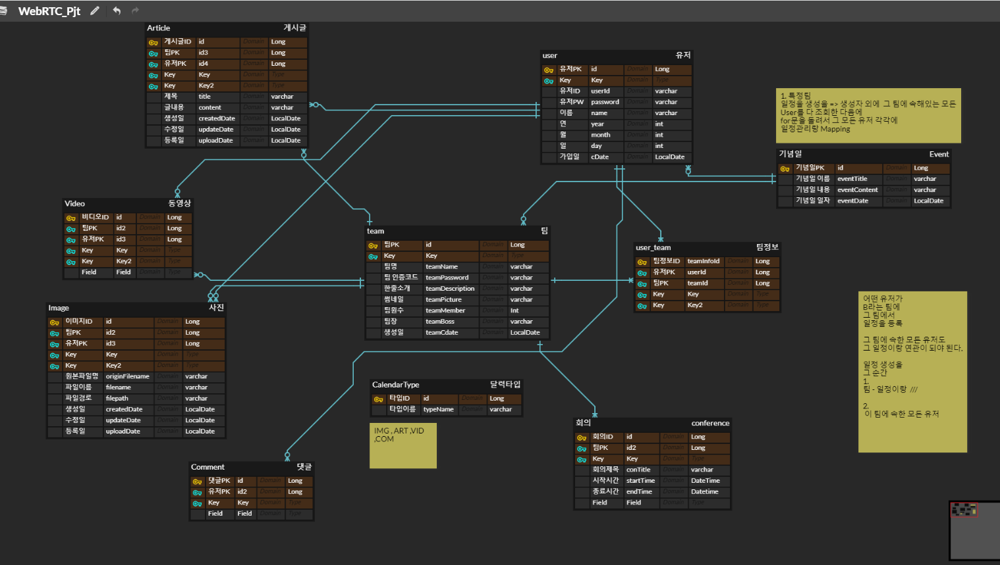
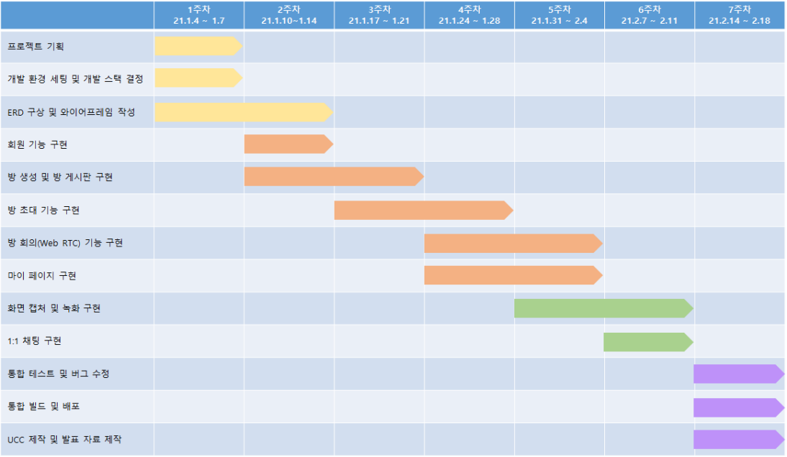
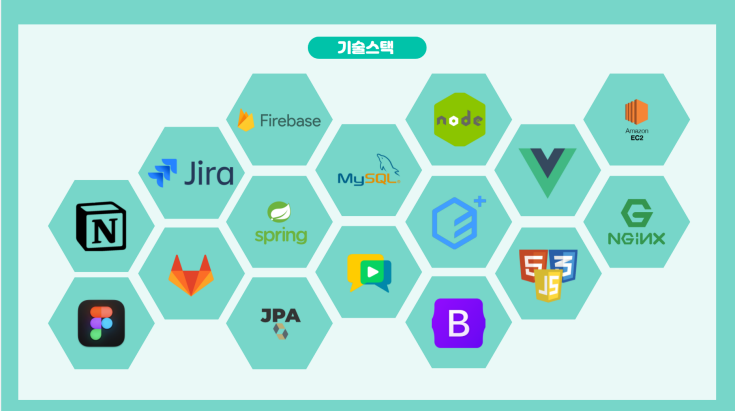
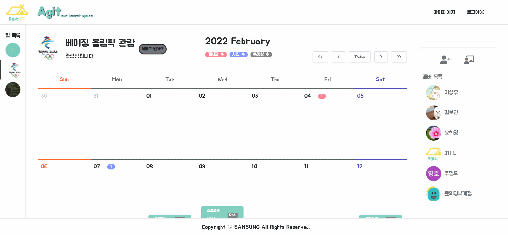
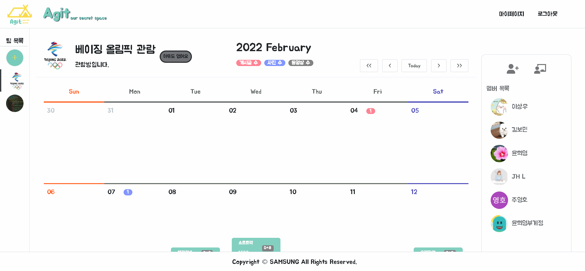
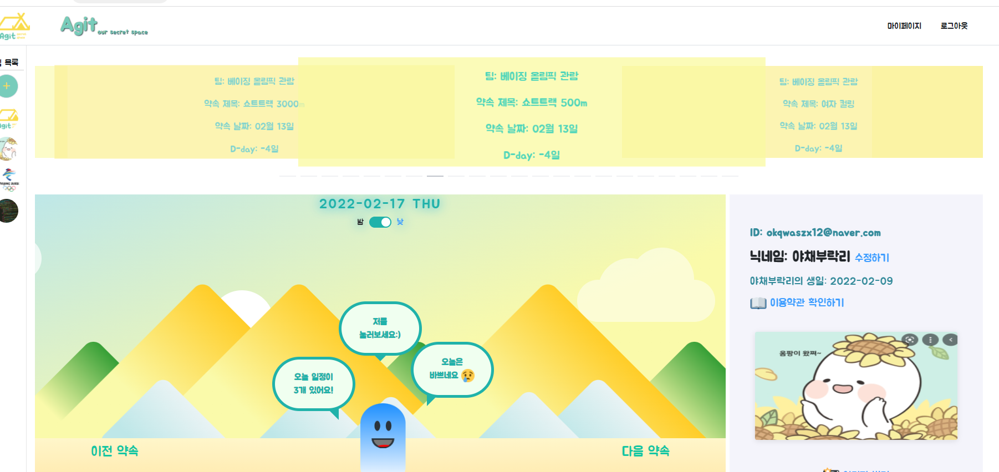

[TOC]

## 👨‍👩‍👦‍👦 아지트 Agit

우리들만의 추억을 만드는 공간 아지트




## 📣 팀원 소개 및 역할

| 팀원       | 역할            | 담당 업무                      | 구현한 기능                                                                                                 |
|:-------- |:-------------:| -------------------------- | ------------------------------------------------------------------------------------------------------ |
| 이상우<br/> | F4   소이정<br/> | 팀장, 서비스 기획 및 백엔드 개발        | - 게시판, 일정 CRUD 기능 구현<br/>- `OpenVidu` 라이브러리를 활용한 Web RTC 화상 회의 및 녹화 기능 구현<br/>- `EC2`와 `Nginx`를 활용한 배포 |
| 윤희영      | F4  송우빈       | 부팀장, 서비스 기획 및 백엔드 개발       | - 방 CRUD 기능 구현<br/>- `Firebase`를 활용한 1:1 채팅 기능 구현 <br/>- 이메일 인증 기능 구현                                  |
| 김보민      | 금잔디           | 기술 자문 담당, 서비스 기획 및 백엔드 개발  | - 이미지, 비디오 CRUD 기능 구현<br/>- 방 초대하기 기능 구현<br/>- 회의 화면 캡처 기능 구현                                          |
| 주영호      | F4  구준표       | 버그잡기 전문, 서비스 기획 및 프론트엔드 개발 | - 사이트 전반 레이아웃 담당<br/>- `element-plus`, `bootstrap` 라이브러리를 활용하여 팀 게시판 구현<br/>- `Bug Fix`                |
| 임지환      | F4  윤지후       | 인간 사이렌, 서비스 기획 및 프론트엔드 개발  | - 사이트 심화 CSS 담당<br/>- `AOS` 라이브러리를 활용한 인트로 페이지 구현<br/>- `SCSS`를 활용하여 마이 페이지 구현                         |
| **용병**   |               |                            |                                                                                                        |
| 허건영      | 찍먹  후 탈주      | 척척박사, 서비스 기획 및 프론트엔드 개발    | - 회원 가입 & 로그인 기능 구현                                                                                    |
| 👧🏻     | 디자이너          | 디자인 자문단                    | - 로고 작성<br/>- UCC 제작 시 엄청난 도움의 손길을 건내주심.                                                               |
| 쿠키       | 고양이           | 팀 마스코트, 츄르 좋아함             | - 분위기가 다운될 때마다 등장하여 분위기를 올려줌.<br/>- 귀여움                                                                |


## ✨프로젝트 소개

---

사회적 거리두기 혹은 서로 다른 이유에 의해 대면으로 만나지 못하는 상황에서 주변 지인들과의 대화가 부족해지고, 같이 추억을 쌓기가 어려운 환경이 되었습니다.

Zoom, Webex와 같은 화상 프로그램을 이용하기엔, 화상의 기능만이 제공되기에 저희가 생각한 대화, 만남의 개념과는 조금 거리가 있습니다. 그래서 저희는 게시판과 일정 관리 기능이 가미된 새로운 화상 회의 프로그램인 아지트를 만들기로 하였습니다.

지인들과 함께 우리만의 방을 만들고, 여기에 모임 날짜, 생일 등 이벤트를 등록해보세요. 달력의 형태로 되어있어 며칠 남았는지 직관적으로 파악할 수 있습니다. 또한, 게시판에 글, 사진, 동영상 등을 등록하여 서로의 의견을 공유할 수도 있습니다. 화상 회의 때 중요한 말이 오간다면 녹화 기능이나 캡처 기능을 사용해보세요.

시간이 지나고 다시금 달력을 넘기면서 지난 날의 추억을 되새길 수 있도록 아지트가 도와드리겠습니다.


## 📜 프로젝트 개요

---

- 프로젝트 기간: 2022.01.04 ~ 2022.02.18 (총 7주)

- 프로젝트 목표 
  
  - Vue 와 Sping boot를 활용한 SPA 구현.
  
  - `OpenVidu`, `Firebase` 등의 라이브러리를 활용한 webRTC와 채팅 기능 구현.
  
  - 피그마, 노션, 지라, 깃랩 등 협업 툴을 적극 활용하여 협업 프로젝트의 의의 이해.

- 아지트의 가치관
  
  - `소중하지 않은 기억은 없다.`
  
  - 교류의 부족에서 오는 외로움을 해소하고, 더 긴밀한 사이가 되도록 함.

- 아지트의 기능
  
  - 실시간 화상 회의(webRTC) + 녹화, 캡처
  
  - 방 별 고유한 달력 형태의 게시판 + 사진, 동영상 등록
  
  - 일정 관리
  
    

## 📅 프로젝트 기획, 진행 과정

---

- 프로젝트 기획 과정
  
  - Figma를 통한 브레인 스토밍 , 아이디어 회의
  
  - 카카오 오븐 및 Figma를 활용한 화면 레이아웃 구성 
    
    https://www.figma.com/file/gPQGMNg3KsTtUjqUjm9NuK/Untitled?node-id=563%3A735
  
  - 기술명세서 양식 작성, 코드 규칙 회의 
    
    https://docs.google.com/spreadsheets/d/1iyIqfEuTVDaKjK-Sq-yhaO8hQse_5EIehIlyWgsn-Vg/edit#gid=0
  
  - ERD cloud를 통한 ERD 작성 

    
  
- 실제 프로젝트 진행 
  
  


## 📠 기술 스택




## ⚙ 개발 환경

- JDK 11 (v11.0.13)
- Node.js (v16.13.1)
- VS code (v1.64.2)
- IntelliJ (v2021.3.21)
- Gradle


## 🎞 주요 기능

**우리 사이트의 아이덴티티를 보여주는 인트로**


**우리들의 일정을 공유하고 추억을 저장하는  Agit 캘린더 공간**

> 캘린더 형식의 게시판을 통해 서로의 기념일과 특정 날짜의 추억을 교환할 수 있습니다. 또한 속한 멤버들과
> 
> 1:1 채팅도 가능합니다.

- 글,이미지, 동영상, 기념일 등록 기능



- 특정 날짜에 있는 추억을 한번에 확인


- 멤버들과의 1:1 채팅



**Agit에서 실시간으로 이루어지는 추억 쌓기**

> 우리들만의 공간인 Agit에서 실시간 영상과 채팅 기능을 제공하고, 오늘 우리가 만든 추억을 영상으로 녹화하거나, 캡처 할 수 있는 기능을 제공합니다.  녹화 영상과 캡처 이미지는 자동으로 팀 게시판으로 저장되어,  우리들만의 추억을 기록 할 수 있습니다.

- webRTC 영상과 채팅


- Agit 배경 이미지 커스텀
  
  우리가 함께하는 공간의 배경이미지를 원하는 이미지로 변경해서 즐길 수 있습니다.


- 영상 녹화 기능


- 캡처와 드로우 기능
  
  캡처 기능과 함께, 사진을 꾸밀 수 있는 드로우 기능도 함께 제공합니다.


**마이페이지에서 이루어지는 또 다른 재미**

> 내가 가입한 팀과 관련된 모든 일정을 한 눈에 모아 볼 수 있고, 나의 프로필 정보를 관리할 수 있습니다.
> 
> 또한 Agit의 마스코트인 젤리를 커스텀 하는 소소한 재미도 제공합니다.

- 나와 관련 된 전체 일정 관리



- 프로필 정보 관리


- 마이페이지 젤리 커스텀


## 💾 Installation

` Frontend`

```bash
cd frontend
npm i 
npm run serve
```

`Backend`

```bash
cd backend-java
./gradlew clean build
cd build/libs
java -jar {jar 파일 명}
```


## 🧐 프로젝트 회고

- 긍정적인 분위기도 좋지만 의견을 자유롭게 소명할 수 있는 분위기를 만드는 것이 정말 중요하다는 것을 느꼈다. 
  
  실제로도  막연히 낙천적이기만 한 협업은 갈등이 극심한 협업만큼이나 위험하다고 한다. 

- 이번 프로젝트에서 파일 구조를 체계적으로 설계하고 진행하지 못한 점이 가장 아쉬웠다. 
  
  프로젝트 초기 기획 단계에서 완벽한 구조를 설계하는게 힘든 경우도 많겠지만, 프로젝트 진행 도중에라도 
  
  설계 가능한 단계에 이르렀다면, 사전에 파일구조를 먼저 설계한 후에 코드를 작성해야겠다.

- 혼자 몇시간동안 해결하지 못하고 끙끙대던 문제를 다같이 고민하니 몇분안에 해결되는 경우가 많았다
  
  충분한 고민을 하는 과정도 중요하지만 팀원들에게 적절히 도움을 요청하는게 정말 중요하다는것을 깨달았다. (Agit팀 👍)

- 주석, 커밋메시지, 코드스타일 등 팀원들들과 하나하나 맞춰야하는 부분들에서 진정한 팀워크, 협동심을 배울 수 있었다.
  
  서로를 위한 규칙과 배려가 팀 프로젝트의 속도와 완성도를 끌어 올리는 것 같다.

- 기획부터 배포까지 내가 겪은 프로젝트 중에서 제일 긴 시간이었다. 다소 긴 시간을 일정에 맞춰 진행하고 이슈가 있을 때 유연하게 대처하는 역량이 발전한 것 같다

무엇보다 소중한 경험을 같이 해준 팀원분들에게 감사하다  🙇‍♂️🙇‍♀️ 💌

